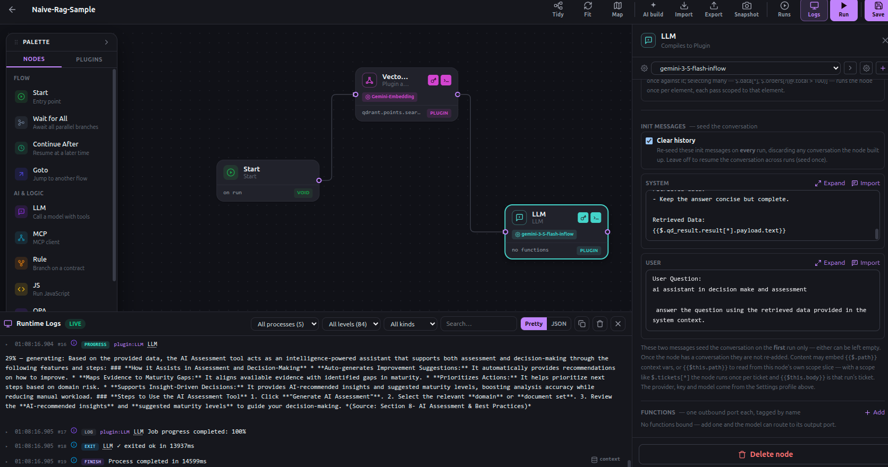
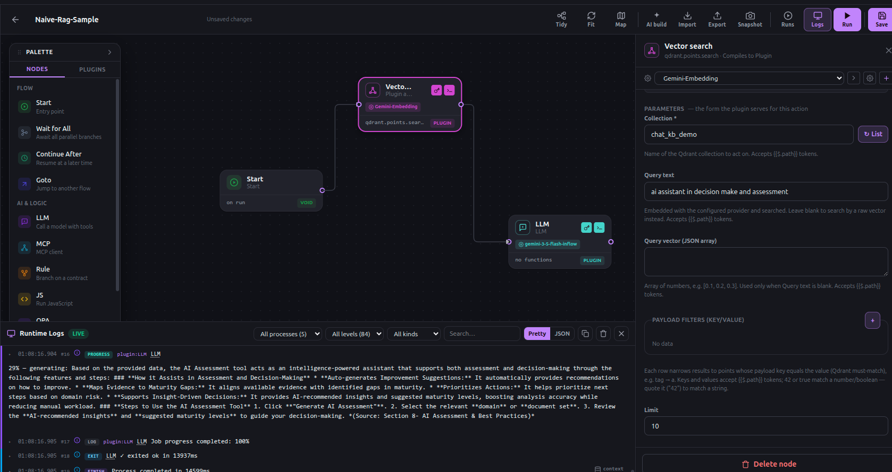

# Naive RAG

**Retrieve, then answer — the whole of baseline RAG in two nodes and an edge.** A Qdrant node embeds the query, searches a collection, and drops the hits into Context; an LLM node reads those hits through a template and answers over them. No retriever framework, no orchestration layer, no glue — the "retrieval-augmented" part is one node's output flowing into another node's prompt.

**Teaches:** a plugin node as a retriever (embedding happens *inside* the store node, via its provider profile) · context injection is just a template (`{{$.qd_result.result[*].payload.text}}`) pointing at the search node's output — there is no "inject context" step · `scoreThreshold` as the quality gate · `clear_history` so every run regenerates the message stack from the current Context instead of accumulating.

---

## Topology

```
Start
  ↓
Vector search      plugin (qdrant.points.search)   key: qd_result
  │   · embeds the query with the node's provider profile (Gemini, gemini-embedding-001)
  │   · searches collection chat_kb_demo, scoreThreshold 0.7, withPayload
  ↓   · hits land at $.qd_result.result
LLM                llm                              key: assistant
      · system prompt pulls the payloads in: {{$.qd_result.result[*].payload.text}}
      · clear_history: true — messages re-seed from current Context each run
```



---

## How it works

- **Vector search** (`plugin`, `qdrant.points.search`, key `qd_result`) is the retriever. It doesn't ship a pre-computed vector — you hand it **query text**, and the node embeds it with the **provider profile selected on the node** (here a Gemini profile using `gemini-embedding-001`) before searching. That's the important move: the embedding model is a *node setting*, not a separate step in the flow. It searches the `chat_kb_demo` collection with `scoreThreshold: 0.7` (only points scoring at or above 0.7 come back), `limit: 10`, and `withPayload: true` so the source text rides along. The result set lands at `$.qd_result.result`.

  

- **LLM** (`llm`, key `assistant`) answers over the hits. Its system prompt ends with `Retrieved Data:\n{{$.qd_result.result[*].payload.text}}` — a template that walks every hit and pulls out `payload.text`. **This template is the entire "augmentation."** There is no node that copies retrieval into the prompt; the prompt simply *reads* the store node's output where it already sits in Context. The instructions tell the model to treat the retrieved data as the source of truth and to say so when it isn't enough — the standard naive-RAG guardrail against invention.

- **`clear_history: true`** on the LLM node is why this is safe to re-run. An LLM node's messages are seeded once and their variables resolve at seed time; left alone across runs, the node would answer against a frozen snapshot of the first retrieval. With `clear_history`, the message stack is **regenerated every run** — the template re-resolves against whatever `qd_result` holds *now*, so a new query text yields a new answer, not an appended turn.

The single edge that makes it RAG: **Vector search → LLM**. Retrieval on one side, generation on the other, the Context between them.

See [`sample-run.json`](sample-run.json) for a sanitized snapshot of the Context after one run — the hits under `qd_result.result` (each with its `score` and `payload`) and the LLM's `messages` re-seeded from them. It's trimmed and scrubbed of internal ids, but the shape is exactly what the template above reads.

Why "naive": one shot, one query, top-k by score, stuff it in the prompt. No query rewriting, no reranking, no multi-hop, no citations back-checked. It's the honest baseline — and the point of the recipe is how little runtime it takes to stand up. Everything past naive (a rerank node, a rewrite step, a judged answer) is *more nodes and edges* on the same Context, not a different kind of system.

> **Why the Qdrant plugin here, not the built-in store?** FloMorphic ships its own internal vector store (finalized in **v0.3.6**), and for a new knowledge base that's the shorter path — no external service to run. This recipe reaches for the **Qdrant plugin** only because its sample collection (`chat_kb_demo`) already lives in Qdrant from an earlier project. The shape of the flow is identical either way: retrieval is one node whose output lands in Context, and the LLM reads it through a template. Point node one at the internal store instead and nothing downstream changes.

---

## Where this goes: a "related tasks" bot for Jira

The toy query is a stand-in. The same two-node shape drops straight into real work — here's a scenario worth building from this recipe.

**One-time (or scheduled) ingest — "vector and save":** an easy flow walks every Jira issue, concatenates title + description, and upserts it into the store keyed by issue id. That's a retriever's mirror image: instead of *searching* the collection you *fill* it, one point per task. (In the cookbook, `qdrant-migrate` shows the fan-out — one upsert node, `scope`'d to run once per item.)

**On every new task — retrieve, then act:** when a task is created, before it settles, the flow embeds its description, vector-searches the collection for similar existing tasks above a threshold, and — if there are hits — **posts a comment on the new task**: *"Looks related to PROJ-214, PROJ-190…"* with links. Duplicate-catching and cross-linking, automatic, at creation time.

Notice what changed and what didn't. **Node one is identical** — the same embed-and-search retriever from this recipe. **Node two swapped its output for an action:** instead of an LLM answering, a plugin node writes a Jira comment (or an LLM node drafts the comment text first, then a plugin posts it — retrieval → generation → action, three nodes on one edge). The "generation" side of RAG was never special; it's just *whatever you do with the hits*. Answer them, comment them, route on them.

That's the recipe's real lesson: once retrieval is one node whose result lands in Context, "add a comment about similar tasks" and "answer a question over documents" are the **same flow** with a different second node.

---

## Run it

1. Import `naive-rag-sample.flow.json` into the FloMorphic canvas.
2. On **Vector search**, select a **store/provider profile** whose embedding model matches the one that built the collection. `chat_kb_demo` here was embedded with **`gemini-embedding-001`** — the query must be embedded by the *same* model, or the vectors won't be comparable and scores will be meaningless. Use **List** on the Collection field to confirm the collection exists in your Qdrant.
3. On **LLM**, select your own **provider/model profile**.
4. Set your query. It appears in two places in this export — the `text` on **Vector search** (what gets embedded and searched) and the user message on **LLM** (what the model is asked). Change both to ask something else.
5. Hit **Run**. The search traces first, hits land at `qd_result`, the LLM re-seeds from them and answers. Every step traces onto the diagram.

---

## Notes on this export

- **This export carries `settingsId` references** (`nset_…`) on both nodes — they point at Node Settings profiles **from the canvas it was exported from**, not yours. They won't resolve in your install; reselect a profile on each node after import (steps 2–3). No credential material travels in the file — a `settingsId` is only a pointer.
- **Collection and embedding model must agree.** The `0.7` threshold assumes cosine scores from `gemini-embedding-001`. Swap the embedding model or the collection and you'll likely need to retune the threshold — a good first thing to feel out by watching which hits pass.
- Node ids, titles, keys (`qd_result`, `assistant`), and positions are kept as exported so the canvas matches this write-up.
